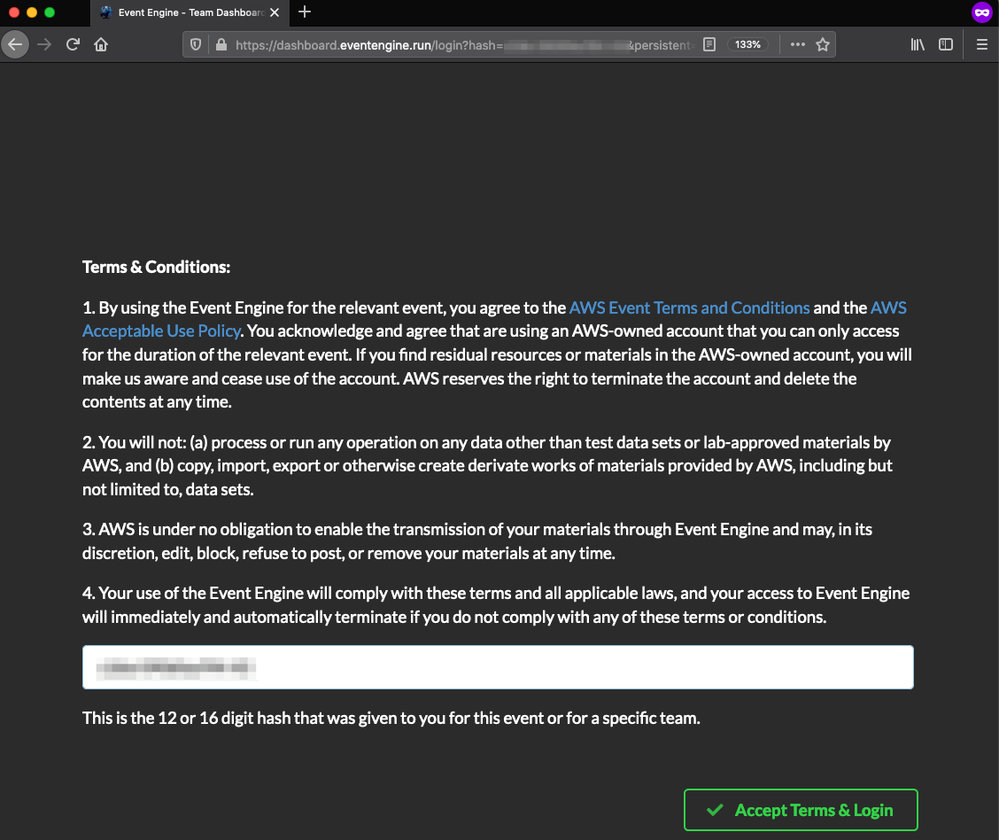
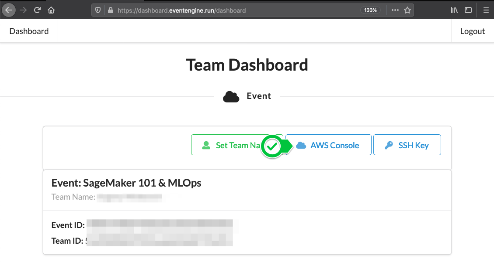
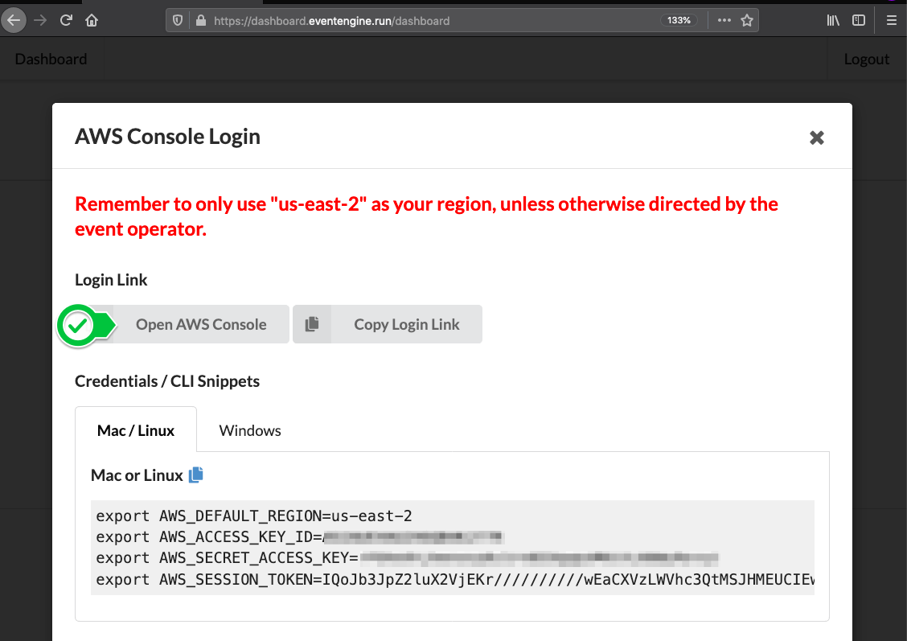
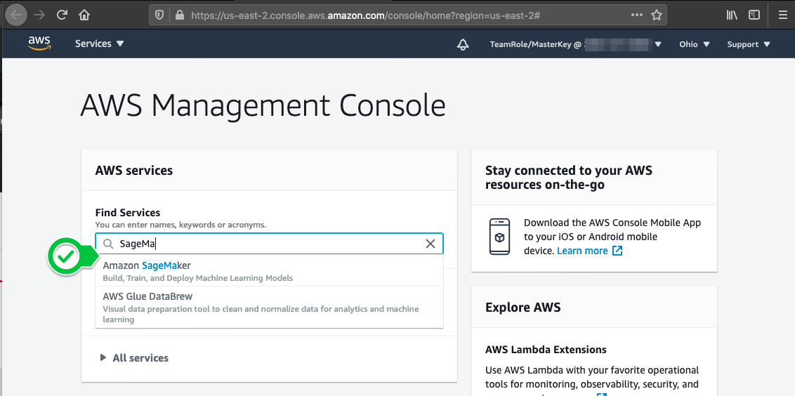
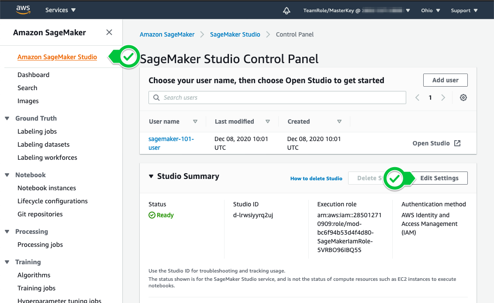
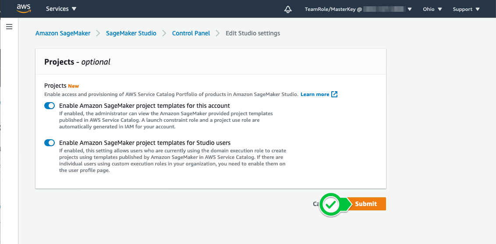
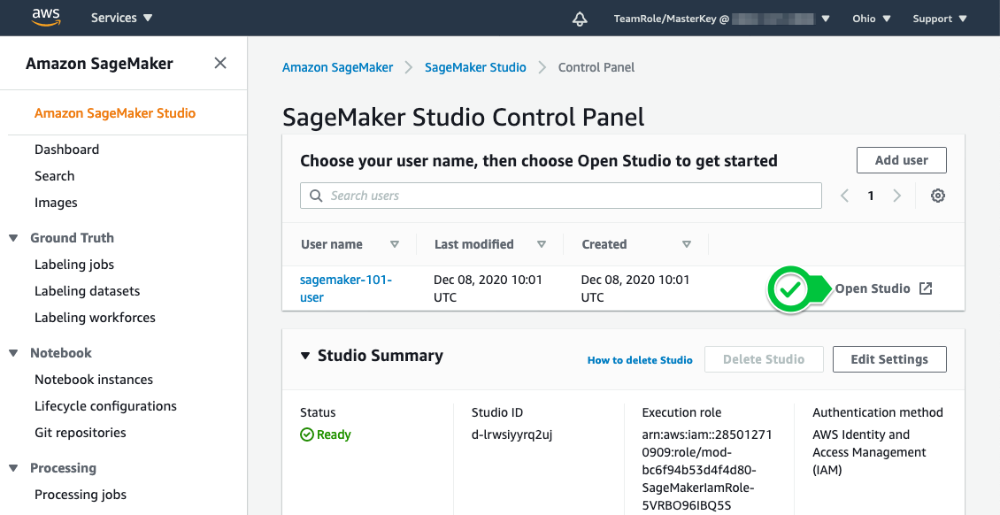
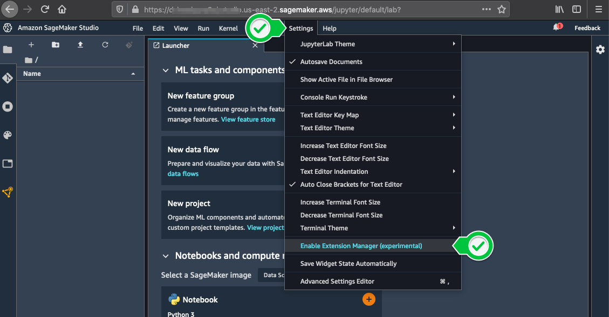
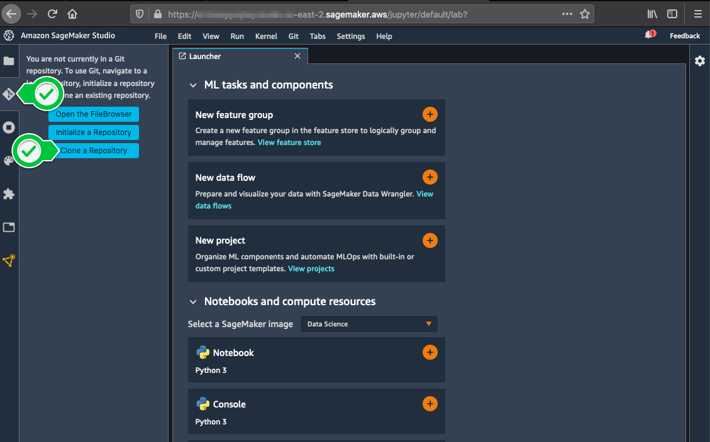

#  Get Started Using the Lab Environment 

You have been provisioned a temporary dedicated AWS account for the purposes of today's workshop. You will have been sent your access details beforehand - A 12-character code (or ‘hash’) that grants you the access to the AWS enviornment.

## 1. Login to the Event Engine 

-  Go to https://dashboard.eventengine.run/, enter the access code and click Proceed: 


 
- Click on AWS Console, then Open AWS Console to login into your dedicated AWS environment.



- 



## 2. Confirm SageMaker permissions 

- Open Amazon SageMaker service



-  Click "Edit" and then "Submit" - this is to confirm the permissions granted to the SageMaker environment


- 


## 3. Enable SageMaker Extension Manager

- Open SageMaker Studio



- Select \"*Settings > Enable Extension Manager (experimental)*\" from the toolbar, and confirm to enable it



- Click on the new jigsaw puzzle piece icon in the sidebar on the left, to open the Extension Manager
- Search for `@jupyter-widgets/jupyterlab-manager` (Scroll down - search results show up *below* the list of currently installed widgets!)
- Click \"**Install**\" below the widget's description, if not installed already
- Wait for the blue progress bar that appears by the search box
- You should be prompted \"*A build is needed to include the latest changes*\" - select \"**Rebuild**\"
- The progress bar should resume, and you should shortly see a \"Build Complete\" dialogue.
- Select \"**Reload**\" to reload the webpage


## 4. Clone the repository into the Studio Environment
- Select the GitHub icon in the panel on the left and click "Clone Repository". Enter 
```
https://github.com/tom5610/sagemaker-workshop-101.git
```



- Alternatively launch a **System terminal** (from the *Other* section of the launcher screen) and run 
```
git clone https://github.com/tom5610/sagemaker-workshop-101.git
```


## 5. Kernel Selection

 You'll be asked to select a kernel when you first open each notebook. 
 
 - Use **Python 3 (Data Science)** as standard 
 - Use **Python 3 (TensorFlow CPU Optimized)** for the 'local' notebooks in NLP and migration challenge folders - they will fit the TensorFlow models within the notebook itself.

You can refer to the [*"How Are Amazon SageMaker Studio Notebooks Different from Notebook Instances?"*](https://docs.aws.amazon.com/sagemaker/latest/dg/notebooks-comparison.html) docs page for more details on differences between the Studio and Notebook Instance environments.